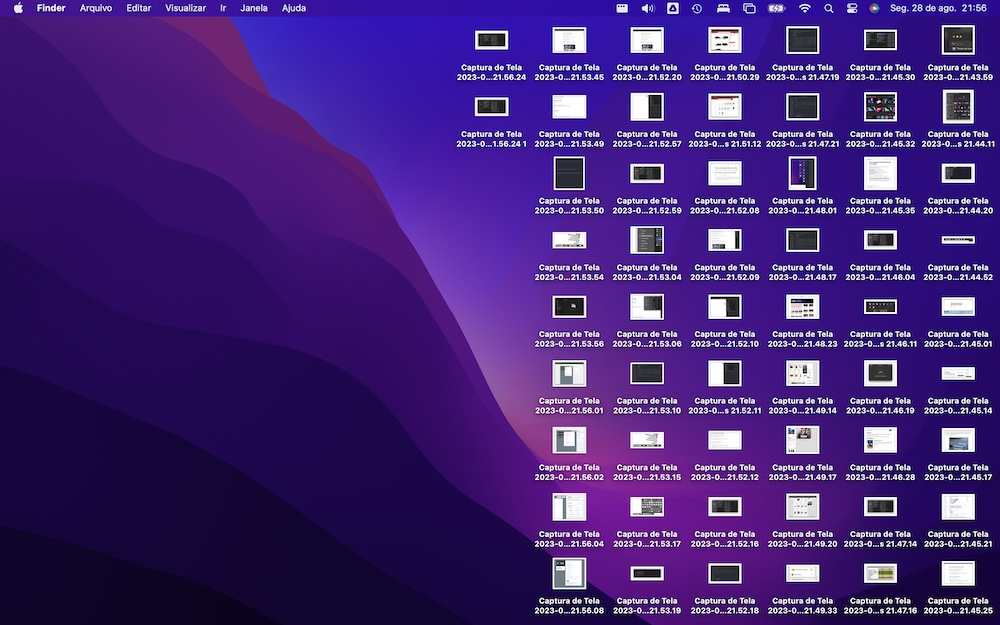
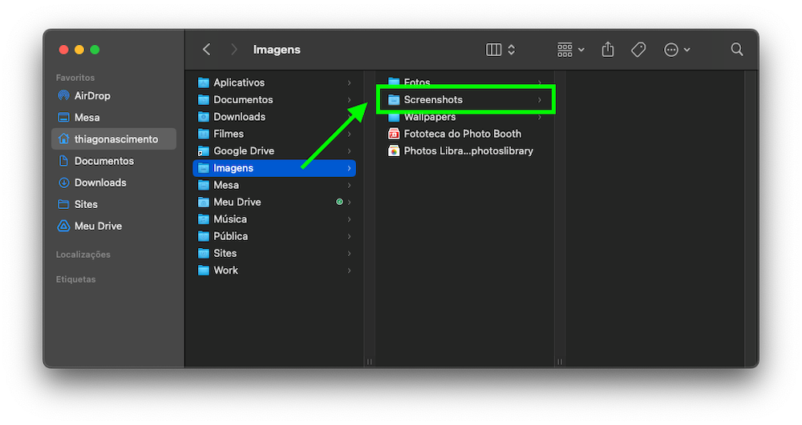
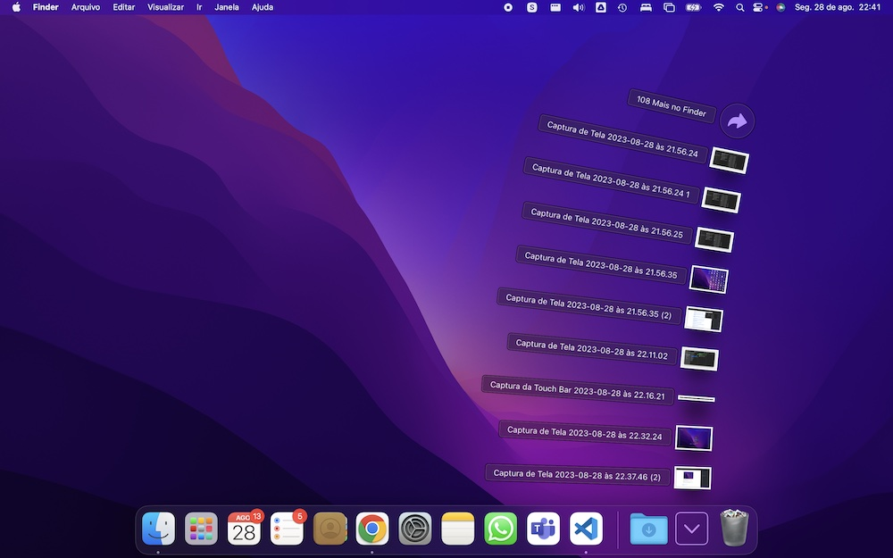

O **macOS** lhe permite nativamente tirar **ScreenShots** de forma extremamente descomplicada, basta pressionar as teclas:

Cmd + Shift + 3 para tirar um print de toda a tela; ou;

Cmd + Shift + 4 para tirar um print de uma porção da tela; ou;

Cmd + Shift + 4 + espaço para tirar print de uma janela completa; ou;

Cmd + Shift + 5 para criar um filme de sua tela.

Você pode ver mais detalhes [nesta página oficial](https://support.apple.com/pt-br/HT201361#:~:text=Mantenha%20pressionadas%20as%20teclas%20Shift%20%2B%20Command%20%2B%204.,barra%20de%20espa%C3%A7o%20enquanto%20arrasta.){:target="_blank"} da Apple.

*Sem grandes novidades até aqui, certo? Mas agora vem o pulo do gato!*

## Organizando seus ScreenShots

Nativamente, todas as **Capturas de Tela** são armazenados em sua **Mesa**, Área de Trabalho ou Desktop, como muitos ainda chamam *(por herança do Windows)*.

Ao final de um bom dia de trabalho com muitas capturas, temos um resultado ~~infelizmente~~ parecido com isso:

{:.img-fluid.rounded}

A boa notícia é que é possível alterar o destino de seus printscreens e aí começa a organização! 😄

1. Crie uma pasta e a renomeie para **Screenshots** (ou o nome que desejar);
{:.img-fluid.rounded}

2. Mova-a para um lugar seguro: em meu caso, sugiro levá-la para dentro da pasta **Imagens**, no diretório padrão de seu usuário;
{:.img-fluid.rounded}

3. Pressione Cmd + Shift + 5, clique em **Opcões** e em seguida **Outra localização**.
{:.img-fluid.rounded}

4. Selecione o diretório **ScreenShots** e assim todos novos prints serão enviados diretamente para lá;

5. Arraste a pasta criada ao dock, criando um atalho simples e rápido. Sugiro posicioná-loa ao lado da pasta Downloads, como na imagem abaixo:
{:.img-fluid.rounded}

_Obs: lembre-se de que é possível configurar diversas formas de visualização no Dock, basta clicar com o botão direito sobre a pasta e escolher a forma desejada!_

**Pronto!**

Seus PrintScreens agora estarão devidamente organizados, não mais preenchendo sua Mesa e facilmente acessíveis para uso e compartilhamento. 😍